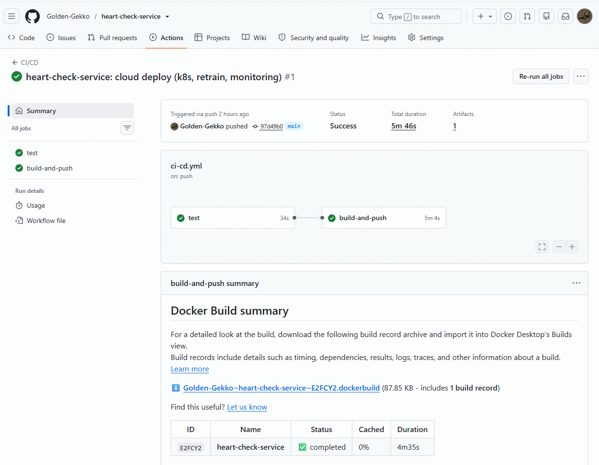
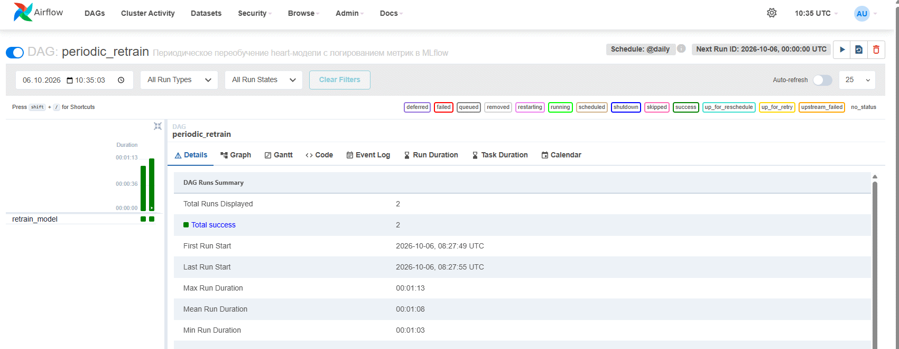
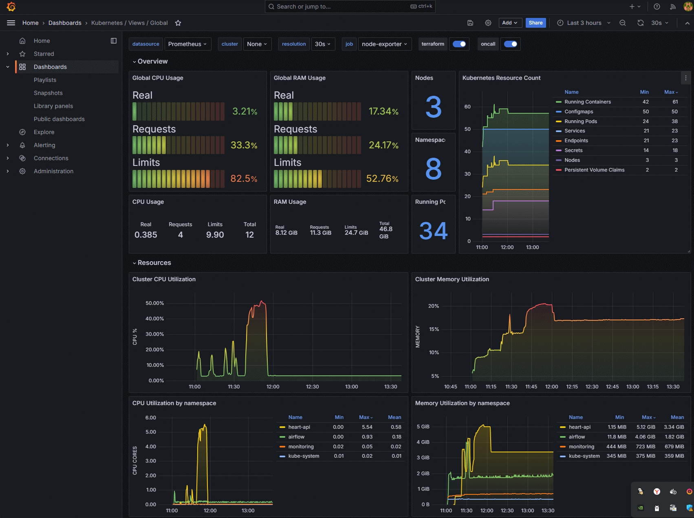

# Курсовой проект: Heart Attack Risk API - развёртывание модели с мониторингом и алертингом

Сервис ML-инференса для предсказания риска сердечного приступа.

---

## ML-задача

- Тип: бинарная классификация.
- Цель: по 22 нормализованным клиническим признакам пациента предсказать наличие высокого риска сердечного приступа (`Heart Attack Risk (Binary)`).
- Целевая метрика: ROC-AUC на отложенной выборке (`test_auc`).
- Данные: `data/heart_train.csv`. Хранятся в S3 (заливка - `scripts/upload_data.py`), обучающая выборка также бандлится в docker-образ.
- Признаки (22):
    - бинарные (6): `diabetes`, `family_history`, `obesity`,
      `alcohol_consumption`, `previous_heart_problems`, `medication_use`;
    - категориальные (3): `diet`, `stress_level`,
      `physical_activity_days_per_week`;
    - числовые (13): `age`, `cholesterol`, `heart_rate`,
      `exercise_hours_per_week`, `sedentary_hours_per_day`, `bmi`,
      `triglycerides`, `blood_sugar`, `ck_mb`, `troponin`,
      `systolic_blood_pressure`, `diastolic_blood_pressure`,
      `sleep_hours_per_day`.
- Пайплайн: `VectorAssembler(22 признака) -> StandardScaler -> RandomForestClassifier`.
- Обучение и логирование - `scripts/train_heart.py` (MLflow, эксперимент `heart_attack`, метрика `test_auc`, регистрация `heart_attack_rf`, alias `champion`).

---

## Запуск

### 1. Подготовка

1. Установите [Terraform](https://developer.hashicorp.com/terraform/downloads), [uv](https://docs.astral.sh/uv/), [kubectl](https://kubernetes.io/docs/tasks/tools/), [yc CLI](https://yandex.cloud/ru/docs/cli/quickstart#install), [Helm](https://helm.sh/docs/intro/install/), `jq` и `envsubst`

2. Получите:
    - **OAuth-токен**: [тут](https://oauth.yandex.ru/)
    - **Cloud ID** и **Folder ID**: в [консоли Yandex Cloud](https://console.cloud.yandex.ru/)
    - **SSH-ключ** (для доступа к MLflow-VM)

3. Создайте репозиторий на GitHub (например `heart-check-service`) и запушьте код

### 2. Настройка Terraform

1. Перейдите в папку с инфраструктурой:
    ```bash
    cd infra
    ```
2. Создайте файл `terraform.tfvars` на основе шаблона:
    ```bash
    cp terraform.tfvars.example terraform.tfvars
    ```
3. Заполните его своими данными:
    ```
    yc_config = {
      token     = "y0__..."  # ваш OAuth-токен
      cloud_id  = "b1g..."   # Cloud ID
      folder_id = "b1g..."   # Folder ID
      zone      = "ru-central1-a"
    }

    public_key_path  = "~/.ssh/id_rsa.pub"
    private_key_path = "~/.ssh/id_rsa"

    kafka_producer_password = "ProducerPass123!"
    kafka_consumer_password = "ConsumerPass123!"
    ```

### 3. Сборка и публикация образа (CI/CD GitHub Actions)

Пуш или PR в ветку `main` автоматически запускает пайплайн (`.github/workflows/ci-cd.yml`):

1. test - `ruff` + юнит-тесты (`pytest tests -v`)
2. build-and-push - при успехе тестов сборка Docker-образа и публикация в `ghcr.io`:
    - при сборке внутри образа обучается heart-модель и запекается локальный MLflow-реестр
    - публикация: `ghcr.io/<USER>/<REPO>:latest` (используется встроенный `GITHUB_TOKEN`)

Пакет должен быть публичным, чтобы кластер мог тянуть образ без `imagePullSecrets`.

### 4. Запуск инфраструктуры

```bash
terraform init
terraform apply
```

Дождитесь завершения. Terraform создаст в Yandex Cloud:
- сеть, подсеть и security groups
- сервисный аккаунт с ролями
- Managed Kubernetes кластер из 3 узлов (`heart-api-k8s`, 4 vCPU / 16 GB на узел)
- Managed Kafka (`heart-api-kafka`) с топиками `inputs`/`predictions`
- MLflow-VM (Compute Instance) с S3-артефактами
- S3 bucket для артефактов и датасетов

После применения Terraform сгенерирует `infra/variables.json` с переменными
окружения (MLflow URI, Kafka bootstrap, S3-ключи, имя кластера).

### 5. Загрузка данных в S3

```bash
uv run python scripts/upload_data.py \
  --bucket <S3_BUCKET_NAME> \
  --key datasets/heart_train.csv
```

### 6. Деплой сервиса

1. Подключите kubectl к кластеру:
    ```bash
    yc managed-kubernetes cluster get-credentials heart-api-k8s --external --force
    kubectl get nodes
    ```

2. Задеплойте приложение, мониторинг (Prometheus/Grafana/Alertmanager) и Airflow одним скриптом:
    ```bash
    bash scripts/deploy_app.sh
    ```

3. Проверьте, что поды приложения поднялись и HPA работает:
    ```bash
    kubectl get pods -n heart-api
    kubectl get hpa -n heart-api    # min 4, max 6 реплик по CPU 80%
    ```

### 7. Bootstrap модели и переобучение

До первого успешного `/ready` в удалённом MLflow должна появиться `heart_attack_rf@champion`. Запустите DAG `periodic_retrain` один раз:

```bash
kubectl exec -n airflow deploy/airflow-scheduler -- airflow dags unpause periodic_retrain
kubectl exec -n airflow deploy/airflow-scheduler -- airflow dags trigger periodic_retrain
```

DAG `periodic_retrain` подгружается автоматически из внешнего git-репозитория через GitSync, обучает модель из S3 (`scripts/train_heart.py`) через `KubernetesPodOperator` и логирует метрику `test_auc` в MLflow, обновляя alias `champion`.

### 8. Тестирование через публичный API

Получите публичный IP узла:
```bash
kubectl get nodes -o wide   # колонка EXTERNAL-IP
```

Сервис опубликован на порт `30080` (`http://<NODE_EXTERNAL_IP>:30080`):

```bash
curl http://<NODE_EXTERNAL_IP>:30080/health
curl http://<NODE_EXTERNAL_IP>:30080/metrics
curl -X POST http://<NODE_EXTERNAL_IP>:30080/predict \
  -H "Content-Type: application/json" \
  -d '{"patients":[{"diabetes":false,"family_history":true,"obesity":false,"alcohol_consumption":false,"previous_heart_problems":true,"medication_use":true,"diet":1,"stress_level":8,"physical_activity_days_per_week":3,"age":0.5,"cholesterol":0.6,"heart_rate":0.7,"exercise_hours_per_week":0.3,"sedentary_hours_per_day":0.8,"bmi":0.75,"triglycerides":0.5,"blood_sugar":0.4,"ck_mb":0.3,"troponin":0.2,"systolic_blood_pressure":0.65,"diastolic_blood_pressure":0.45,"sleep_hours_per_day":0.6}]}'
```

Ожидаемый ответ `health`:
```json
{"status":"healthy","model_loaded":true,"model_name":"heart_attack_rf","model_alias":"champion"}
```

Доступны также совместимые с `workshop_1` эндпоинты: `POST /api/get_prediction/` (одно предсказание, ответ `{"predict": %}`) и `POST /api/get_predictions/` (CSV-файл, ответ `[{"id", "predict"}]`).

### 9. Имитация атаки и срабатывание алерта

1. Экспортируйте переменные Kafka из `infra/variables.json`:
    ```bash
    export KAFKA_BOOTSTRAP_SERVERS=<bootstrap>
    export KAFKA_INPUT_TOPIC=inputs
    export KAFKA_PRODUCER_USER=producer
    export KAFKA_PRODUCER_PASSWORD=<password>
    export KAFKA_CONSUMER_USER=consumer
    export KAFKA_CONSUMER_PASSWORD=<password>
    export KAFKA_SECURITY_PROTOCOL=SASL_SSL
    export KAFKA_SASL_MECHANISM=SCRAM-SHA-512
    export API_URL=http://<NODE_EXTERNAL_IP>:30080/predict
    ```

2. Запустите наращивание потока событий:
    ```bash
    uv run python scripts/load_test.py \
      --start-rate 100 \
      --ramp-step 20 \
      --ramp-interval 30 \
      --max-rate 600 \
      --workers 32 \
      --duration 780
    ```

Нагрузочный тест публикует синтетических пациентов в Kafka-топик `inputs` и вызывает `/predict`. При росте нагрузки:
- HPA масштабирует `heart-api` с 4 до 6 реплик;
- CPU подов превышает 80%;
- через 5 минут срабатывает алерт `HeartAPIHighLoad`.

### 10. Остановка (очистка)

```bash
cd infra
terraform destroy
```

---

## Скриншоты

### GitHub Actions: успешный CI/CD прогон



### Yandex Cloud: k8s кластер из 3 узлов


### MLflow: зарегистрированная модель `heart_attack_rf@champion`


### Airflow: успешный прогон DAG `periodic_retrain`



### Kubernetes: увеличение до 6 реплик


### Grafana



### Prometheus: алерт `HeartAPIHighLoad`


